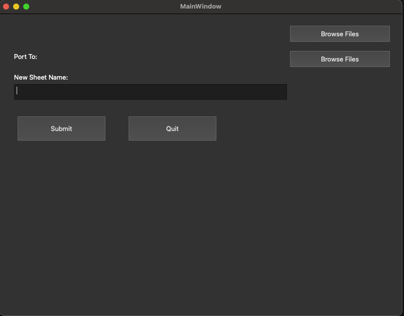

# Automating_Excel_Data_Transfer
Automating Excel File Transfers with GUI.

Look how easy it is to use:

    GUI is self explanatory




Features
--------

- Looks for useful data, cleans data removing empty cells & hidden cells, populating empty cells that make sense and collates data from all sheets into one Sheet in another workbook.
- Useful Headers are checked for and used for data.
- GUI built using Pyqt5
- Excel Manipulation done using openpyxl

Installation
------------

Type in Terminal: 
pyinstaller --onefile --noconsole Theresa.py

Python Virtual Environment Setup
------------

Follow these steps to set up your environment and install dependencies.

Prerequisites
------------


- Python 3.x must be installed  
  Check your version:
  ```sh
  python --version
  # or
  python3 --version
  ```

Create a Virtual Environment
------------

```sh
python -m venv venv
# or
python3 -m venv venv
```

Activate the Virtual Environment
------------

Windows
------------

```sh
venv\Scripts\activate
```

macOS/Linux
------------

```sh
source venv/bin/activate
```

Install Dependencies
------------

```sh
pip install -r requirements.txt
```

Freeze Dependencies (Optional)
------------

```sh
pip freeze > requirements.txt
```

Deactivate the Environment
------------

```sh
deactivate
```

Contribute
----------

- Issue Tracker: https://github.com/JoachimStanislaus/Automating_Excel_Data_Transfer/issues
- Source Code: https://github.com/JoachimStanislaus/Automating_Excel_Data_Transfer

Support
-------

If you are having issues, please let us know.
We have a mailing list located at: hello@JoachimStanislaus.com

Documentation
-------
